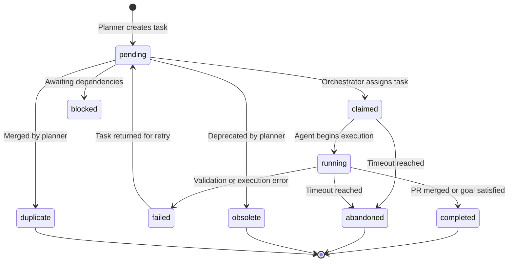
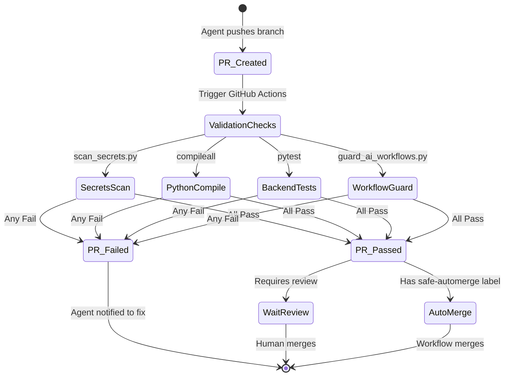
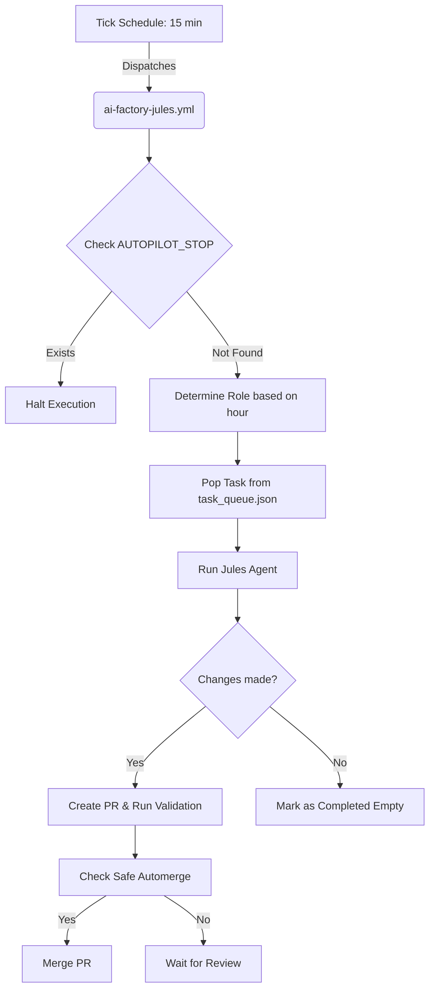

# AutoGen AI Factory

*The autonomous AI orchestration platform for continuous development.*

Welcome to AutoGen AI Factory! This project acts as an autonomous AI orchestration platform that utilizes Directed Acyclic Graph (DAG) task routing, asyncio, and the Model Context Protocol (MCP) to manage a multi-agent continuous workflow.

## Why this project matters
The AI Factory demonstrates how a team of specialized AI agents can autonomously operate, maintain, and expand a full-stack web application. By operating in a continuous, zero-human-in-the-loop pipeline, it explores the boundaries of long-running autonomous development and self-healing systems.

## Main Features
- **Autonomous Multi-Agent Workflow:** A scheduled GitHub Actions pipeline that orchestrates specialized AI agents (Planner, Implementer, Tester, Reviewer, Documenter, Security, Architect, Refactorer) to continuously improve the codebase.
- **DAG-Based Task Routing:** Dynamic task generation and assignment based on explicit dependencies and capabilities.
- **Model Context Protocol (MCP):** Safe, standardized tool execution and skill integration for agents.
- **Strict Validation Protocol:** Zero-trust verification requiring comprehensive testing, secret scanning, and syntax checks before any change is merged.
- **FastAPI & Asyncio Backend:** A scalable, non-blocking orchestration server built with Python 3.11.
- **Vanilla JS Frontend:** A lightweight, dependency-free frontend with native Node.js testing.

## AI Factory Architecture Summary
The AI Factory runs locally for interactive development and in GitHub Actions for continuous autonomy.
- **The Queue (`task_queue.json`):** Tasks are pulled from a central backlog, defining strict scopes and constraints.
- **The Orchestrator:** The Python backend, driven by Pydantic models and asynchronous session management, manages agent lifecycles, skill execution, and workspace I/O.
- **The Pipeline (`ai-factory-jules.yml`):** The CI/CD workflow dispatches agents sequentially, validates their pull requests, and automerges safe changes.
- **Validation:** Pull requests must pass comprehensive validation (including dependency installation, compilation checks, secret scans, workflow guards, backend tests, and frontend tests) before being considered safe for auto-merge.

## Agent Roles
The factory operates using specialized roles, each with defined capabilities and boundaries:
- **Planner:** Manages the task backlog and determines the next priority.
- **Implementer:** Writes backend and frontend application code.
- **Tester:** Improves test coverage and adds validation checks.
- **Reviewer:** Reviews recent PRs for architecture drift and code quality.
- **Documenter:** Maintains and improves documentation and setup guides.
- **Security:** Audits dependencies and hardens application boundaries.
- **Architect:** Updates high-level architecture decisions and state.
- **Refactorer:** Improves code readability and reduces duplication.

## Lifecycle & Automerge Policy
Automerge is intentionally conservative to prevent autonomous regressions:
- A PR can be merged automatically **only** when `AI Factory Validate` passes (including all core and test validation checks), it is not a draft, the title starts with `ai-factory(documenter):` or `ai-factory(tester):`, and it has the label `ai-factory:safe-automerge`.
- All implementation, refactor, security, and architecture PRs require human review.
- The validation pipeline utilizes `guard_ai_workflows.py` to ensure infrastructure files (`.github/workflows/`, `.github/scripts/`, `.github/CODEOWNERS`) remain locked and are not modified by autonomous agents.


## Task Lifecycle



## PR Lifecycle



## GitHub Actions Workflow



## Screenshots / UI Preview
*(Screenshots are planned.)*

## Quickstart

```bash
# 1. Prerequisites
# - Python 3.11
# - Node.js v20+

# 2. Clone the repository
git clone <repository-url>
cd <repository-directory>

# 3. Set up virtual environment
python3 -m venv venv
source venv/bin/activate # (Mac/Linux)
# venv\Scripts\activate # (Windows)

# 4. Install dependencies
pip install -q -r backend/requirements.txt
pip install -q pytest pytest-cov anyio httpx  # testing dependencies

# 5. Configure environment
cp .env.example .env
# Open .env and set AUTOGEN_API_KEY (required), adjust system paths, or tweak model settings.
# IMPORTANT: Never commit the .env file to version control.
# IMPORTANT: The backend utilizes pydantic-settings to safely load configuration, prioritizing environment variables over .env variables.

# 6. Run validation commands
pip install -q -r backend/requirements.txt && pip install -q pytest pytest-cov anyio httpx && python -m compileall backend skills_library run.py && python .github/scripts/scan_secrets.py && python .github/scripts/guard_ai_workflows.py && PYTHONPATH=. python -m pytest -q && node --experimental-test-coverage --test frontend/tests/*.test.js > /tmp/coverage.txt 2>&1 && (git rm -r --cached frontend/coverage/ .coverage || true) && rm -rf frontend/coverage/ .coverage
# python -m json.tool <filepath> > /dev/null  # Run individually on changed JSON files
# See docs/LOCAL_DEVELOPMENT.md for the complete mandatory validation suite and docs/TROUBLESHOOTING.md for Git errors.

# 7. Start the application
python run.py
```
*(Note: See [Local Development Setup Guide](docs/LOCAL_DEVELOPMENT.md) for detailed configurations, `PYTHONPATH` instructions for testing, and Windows activation commands.)*

## Documentation

- [Local Development Setup](docs/LOCAL_DEVELOPMENT.md) - Comprehensive guide for setup, secrets, validation, and operations.
- [AI Factory Operations](docs/AI_FACTORY.md) - Details on GitHub Actions, autonomous roles, and factory workflows.
- [API and Architecture Notes](docs/API_NOTES.md) - High-level overview of backend services, endpoints, and orchestration.
- [Agent Instructions](AGENTS.md) - Core guidelines, constraints, and rules for autonomous AI contributors.
- [Mission & Goals](mission.md) - High-level project objectives and operating principles.
- [Troubleshooting](docs/TROUBLESHOOTING.md) - Common issues and solutions for local setup, validation, and operations.

## Project Structure

- `backend/` - FastAPI application and orchestration logic.
- `frontend/` - Static HTML/CSS/JS UI files.
- `skills_library/` and `custom_skills/` - Skill implementations.
- `data/` - Runtime JSON state.
- `.github/ai-factory/` - Autonomous development state, task planning files, and metrics tracking (`metrics.json`).

## Local Development Setup & Operations

Detailed instructions for setup, configuration, secrets, validation commands, and continuous integration have been moved to a dedicated guide:

👉 **[Read the Local Development Setup Guide](docs/LOCAL_DEVELOPMENT.md)**

## Limitations
- The orchestrator operates under strict token and round limits.
- Agent tools are confined to the local workspace boundary to prevent arbitrary system modification.
- Only specific backend configurations are accessible via the UI or `.env`.

## Roadmap
- Additional robust UI components and dark-mode themes for the command center.
- Broader MCP plugin integration.
- Stronger agent-to-agent communication pathways and self-correcting review loops.
- Extended metrics dashboard.
