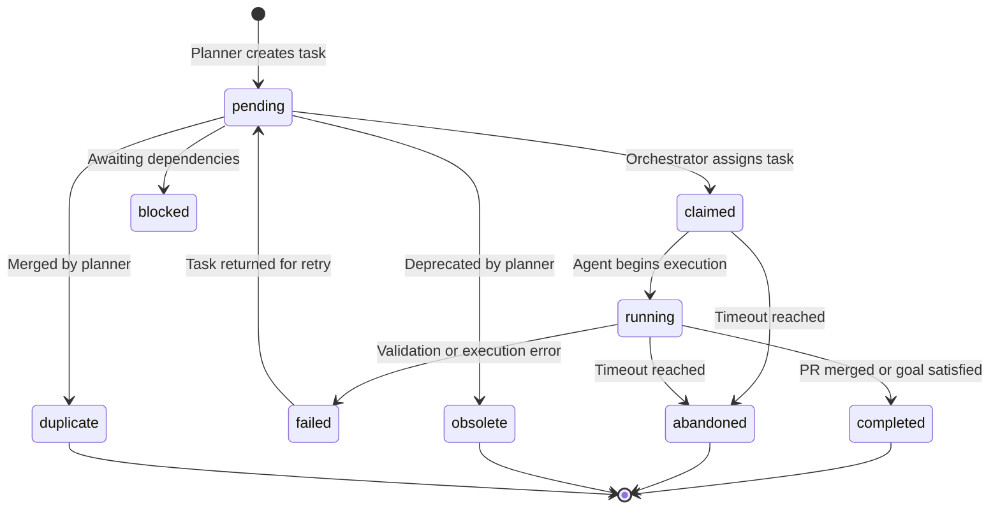
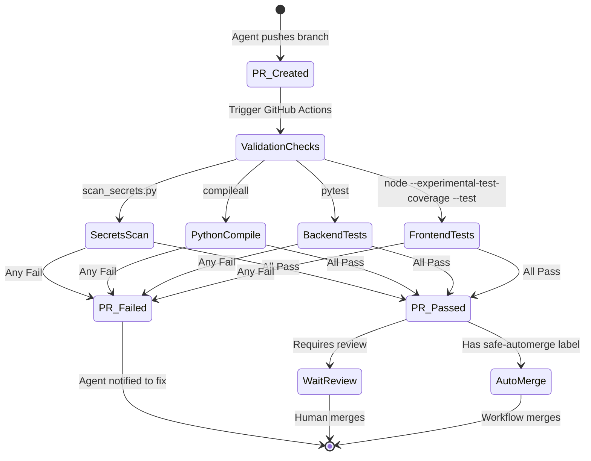
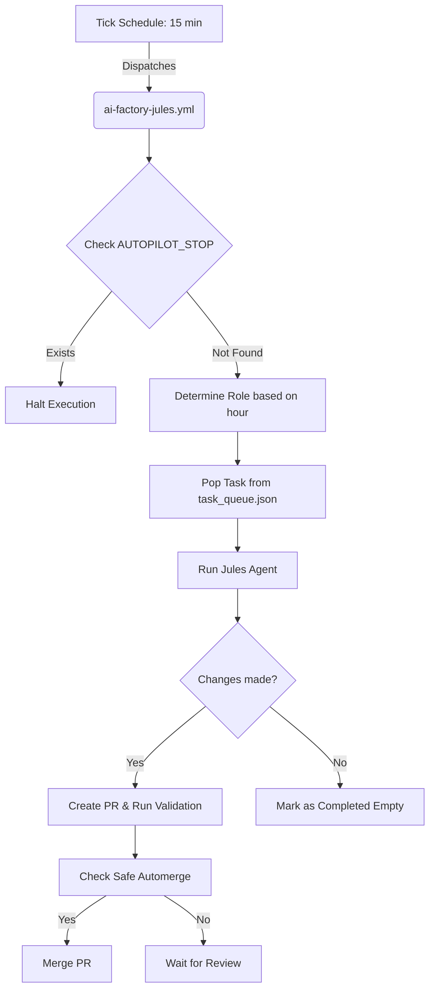

# AutoGen AI Factory

*The autonomous AI orchestration platform for continuous development.*

Welcome to AutoGen AI Factory! This project acts as an autonomous AI orchestration platform that utilizes Directed Acyclic Graph (DAG) task routing, asyncio, and the Model Context Protocol (MCP) to manage a multi-agent continuous workflow.

## Why this project matters
The AI Factory demonstrates how a team of specialized AI agents can autonomously operate, maintain, and expand a full-stack web application. By operating in a continuous, zero-human-in-the-loop pipeline, it explores the boundaries of long-running autonomous development and self-healing systems.

## Main Features
- **Autonomous Multi-Agent Workflow:** A scheduled GitHub Actions pipeline that orchestrates specialized AI agents (Planner, Implementer, Tester, Reviewer, Documenter, Security, Architect, Refactorer) to continuously improve the codebase.
- **DAG-Based Task Routing:** Dynamic task generation and assignment based on explicit dependencies and capabilities.
- **Model Context Protocol (MCP):** Safe, standardized tool execution and skill integration for agents.
- **Strict Validation Protocol:** Zero-trust verification requiring comprehensive testing, secret scanning, and syntax checks before any change is merged.
- **FastAPI & Asyncio Backend:** A scalable, non-blocking orchestration server built with Python 3.12.
- **Vanilla JS Frontend:** A lightweight, dependency-free frontend with native Node.js testing.

## AI Factory Architecture Summary
The AI Factory runs locally for interactive development and in GitHub Actions for continuous autonomy.
- **The Queue (`task_queue.json`):** Tasks are pulled from a central backlog, defining strict scopes and constraints.
- **The Orchestrator:** The Python backend, driven by Pydantic models and asynchronous session management, manages agent lifecycles, skill execution, and workspace I/O.
- **The Pipeline (`ai-factory-jules.yml`):** The CI/CD workflow dispatches agents sequentially, validates their pull requests, and automerges safe changes.

## Agent Roles
The factory operates using specialized roles, each with defined capabilities and boundaries:
- **Planner:** Manages the task backlog and determines the next priority.
- **Implementer:** Writes backend and frontend application code.
- **Tester:** Improves test coverage and adds validation checks.
- **Reviewer:** Reviews recent PRs for architecture drift and code quality.
- **Documenter:** Maintains and improves documentation and setup guides.
- **Security:** Audits dependencies and hardens application boundaries.
- **Architect:** Updates high-level architecture decisions and state.
- **Refactorer:** Improves code readability and reduces duplication.

## Lifecycle & Automerge Policy
Automerge is intentionally conservative to prevent autonomous regressions:
- A PR can be merged automatically **only** when `AI Factory Validate` passes, it is not a draft, the title starts with `ai-factory(documenter):` or `ai-factory(tester):`, and it has the label `ai-factory:safe-automerge`.
- All implementation, refactor, security, and architecture PRs require human review.


## Task Lifecycle



## PR Lifecycle



## GitHub Actions Workflow



## Screenshots / UI Preview
*(Screenshots are planned.)*

## Quickstart

```bash
python3 -m venv venv
source venv/bin/activate
pip install -q -r backend/requirements.txt
pip install -q pytest pytest-cov  # testing dependencies
cp .env.example .env
python run.py
```
*(Note: Ensure Node.js (v20+) is installed for frontend testing. See [Local Development Setup](#local-development-setup) for detailed configurations, `PYTHONPATH` instructions for testing, and Windows activation commands.)*

## Documentation

- [AI Factory Operations](docs/AI_FACTORY.md) - Details on GitHub Actions, autonomous roles, and factory workflows.
- [API and Architecture Notes](docs/API_NOTES.md) - High-level overview of backend services, endpoints, and orchestration.
- [Agent Instructions](AGENTS.md) - Core guidelines, constraints, and rules for autonomous AI contributors.
- [Mission & Goals](mission.md) - High-level project objectives and operating principles.
- [Troubleshooting](docs/TROUBLESHOOTING.md) - Common issues and solutions for local setup, validation, and operations.

## Project Structure

- `backend/` - FastAPI application and orchestration logic.
- `frontend/` - Static HTML/CSS/JS UI files.
- `skills_library/` and `custom_skills/` - Skill implementations.
- `data/` - Runtime JSON state.
- `.github/ai-factory/` - Autonomous development state, task planning files, and metrics tracking (`metrics.json`).

## Local Development Setup

To prepare the repository for local development, follow these steps:

### 1. Prerequisites
- **Python 3.12:** The backend is built specifically for Python 3.12. Ensure it is installed and active in your environment.
- **Node.js (v20+):** Ensure Node.js (v20+) is installed to run frontend vanilla JS unit tests using the native test runner.

### 2. Virtual Environment & Dependency Installation
It is highly recommended to use a Python virtual environment to isolate project dependencies.

```bash
# Create a Python virtual environment
python3 -m venv venv

# Activate the virtual environment (Mac/Linux)
source venv/bin/activate

# Activate the virtual environment (Windows)
venv\Scripts\activate

# Install dependencies
pip install -q -r backend/requirements.txt
pip install -q pytest pytest-cov
```

*Note for AI Agents: Do not attempt to use `python -m venv` or source virtual environments within `run_in_bash_session`. The sandbox environment will block the execution. Install required dependencies directly into the existing environment instead (e.g., `pip install -q -r backend/requirements.txt`).*

Once activated, install the necessary packages for the backend and testing tools. See the [Validation Commands](#validation-commands) section for the full suite of dependency installation and validation commands.

*(Note for testing: For async tests, prefer using `@pytest.mark.anyio` instead of `@pytest.mark.asyncio`. The `anyio` plugin is natively available via the project's FastAPI/HTTPX dependencies, ensuring tests run successfully in CI environments where `pytest-asyncio` might not be installed.)*

### 3. Secrets & Configuration
Never commit secrets, API keys, or credentials. Follow these steps to configure your local runtime:

1. **Create Environment File**: Copy the example environment file:
   ```bash
   cp .env.example .env
   ```
2. **Configure Credentials**: Your local `.env` file is meant for development. Key environment variables include:
   - `AUTOGEN_API_KEY`: Your language model API key.
   - `AUTOGEN_DEFAULT_MODEL`: The default model (e.g., `gemini-2.5-flash`).
   - `AUTOGEN_ROUTER_MODEL`: The model to use for the orchestrator router.
   - `AUTOGEN_BASE_URL`: The base URL for the API endpoint (defaults to Google's Gemini API).
   - `AUTOGEN_ENV_FILE`: The path to the custom .env configuration file (defaults to .env in project root).
   - `AUTOGEN_MAX_ROUNDS`: The maximum number of conversational rounds allowed (defaults to 15).
   - `AUTOGEN_TEMPERATURE`: The temperature parameter for model generation (defaults to 0.7).
   - `AUTOGEN_MAX_TOKENS`: The maximum tokens parameter for model generation (defaults to 4096).
   - `AUTOGEN_DATA_DIR`: The directory where runtime JSON data is stored.
   - `AUTOGEN_SKILLS_DIR`: The directory for built-in skills.
   - `AUTOGEN_CUSTOM_SKILLS_DIR`: The directory for custom skills.
   - `AUTOGEN_WORKSPACE_DIR`: The directory for session workspace files.

   **Configuration Handling Details:**
   - **Environment Variables**: The backend utilizes `pydantic-settings` to safely load configuration, strictly prioritizing environment variables over `.env` variables and JSON defaults. By default, `env_ignore_empty=True` is used to ignore empty environment variables. However, this setting only applies to the environment. If empty strings (`""`) or whitespace-only strings are passed directly via `**kwargs` (e.g., from UI updates) to fields, they bypass this setting and can inadvertently overwrite valid defaults. To ensure robust fallbacks for kwarg-provided empty strings or whitespace-only strings (or for path fields that explicitly support them), a `@field_validator(mode='before')` must be used to intercept falsy or whitespace-only strings and retrieve the fallback. Additionally, fields relying on this pre-validator should set `json_schema_extra={"env_ignore_empty": False}` to ensure the validator also catches empty values originating from `.env`.
   - **Legacy Migration**: Legacy JSON configurations (`data/settings.json`) are automatically migrated to the `.env` file upon startup, securing credentials by immediately clearing the legacy JSON file after migration.
   - **UI Updates**: Configuration changes made via the UI will dynamically update the local `.env` file, persisting only the explicitly changed fields to prevent accidental overwrites with defaults. **The web UI is the primary and recommended way to manage these settings post-setup**, whereas `.env` editing is best for initial bootstrapping.
   - **Clearing Values**: When programmatically clearing configuration values, `dotenv.unset_key` and `os.environ.pop` must be used.
   - **Testing .env Isolation**: When testing configuration logic that interacts with `.env` files, tests must not mutate the root `.env` file. Instead, override `AUTOGEN_ENV_FILE` and `backend.config.ENV_FILE` to point to a temporary file path to maintain test determinism.
3. **Verify Secrets**: You must verify that no secrets are accidentally committed before submitting PRs by running the repository's secret scanner:
   ```bash
   python .github/scripts/scan_secrets.py
   ```
   If a secret is found in a tracked file (e.g. `data/settings.json`), replace the value with `""` or a placeholder like `REPLACE_ME` and re-run the scanner. Move real credentials to your local `.env`.

### 4. Running Tests
To ensure code reliability, run both backend and frontend validation locally before submitting changes.

**Backend Validation:**
```bash
pip install -q -r backend/requirements.txt
pip install -q pytest pytest-cov
PYTHONPATH=. python -m pytest -q
```
*Note: If using `pytest --cov` locally, ensure the auto-generated `.coverage` binary artifact is deleted (e.g., `rm .coverage`) before final submission to prevent accidentally committing it.*

**Frontend Validation:**
```bash
node --experimental-test-coverage --test frontend/tests/*.test.js
```

### 5. Continuous Integration & AI Factory
The repository leverages GitHub Actions to orchestrate the continuous autonomous workflow and validate all code changes automatically.

**Required GitHub Setup:**
1. **App Installation:** Install/connect the repository in the Jules web app.
2. **API Key Creation:** Create a Jules API key.
3. **Secret Configuration:** Add repository secrets (navigate to **Settings -> Secrets and variables -> Actions**, then click **New repository secret**). Do not use Environment Secrets or Repository Variables.
   - Name: `JULES_API_KEY`
     Value: your Jules API key
   - Name: `AUTOGEN_API_KEY` (if your models require authentication)
     Value: your LLM provider API key
4. **Action Permissions:** Ensure workflows can modify the repository. Navigate to **Settings -> Actions -> General -> Workflow permissions** and select **Read and write permissions** and check **Allow GitHub Actions to create and approve pull requests**.
5. **Action Verification:** Confirm GitHub Actions are enabled for the repository.
6. **Autopilot Activation:** The GitHub Actions workflow `AI Factory Tick` runs automatically on a schedule. By default, it will not process tasks if an `AUTOPILOT_STOP` file is present in the repository root. Ensure no `AUTOPILOT_STOP` file exists to allow the autonomous workflows to execute. To safely halt autonomous execution at any time, simply create an empty file named `AUTOPILOT_STOP` in the repository root. To resume, delete the `AUTOPILOT_STOP` file.

Make sure these setup steps are fully completed to ensure that continuous integration checks and scheduled tasks run properly.

**Authoritative Validation:** GitHub Actions validation is the single source of truth for repository checks. Local validation commands mirror the remote pipeline, but PRs cannot merge if the remote pipeline fails.

For detailed workflows and auto-merge requirements, refer to [AI Factory Operations](docs/AI_FACTORY.md).
*Important: Never modify `.github/workflows`, `.github/scripts`, or `.github/CODEOWNERS` directly, as infrastructure changes require a human PR outside of the AI Factory.*

### 6. Emergency Stop Protocol
If you need to stop autonomous background tasks, create an empty file named `AUTOPILOT_STOP` in the repository root directory:
```bash
touch AUTOPILOT_STOP
```
This halts scheduled execution both locally and on GitHub Actions.

## Starting the Application

To start the local FastAPI server and serve the frontend:

```bash
python run.py
```
This starts the application at `http://localhost:8000`.

*Note: If running the application in the background, prefer writing logs to `/tmp/` (e.g., `python run.py > /tmp/app_output.log 2>&1 &`) to prevent accidentally committing generated runtime logs. If generated in the working directory, you must explicitly remove them.*

## Validation Commands

Running the full validation suite from the **repository root** is **mandatory** before opening a PR or pushing any code changes. This ensures code quality, architectural constraint adherence, and prevents secret leakage. If you make frontend changes, you must also complete the **Frontend Visual Validation** workflow described below.

Verify Python syntax, scan for secrets, run tests, and check JSON syntax. Test dependencies must be installed manually first. `PYTHONPATH=.` is required to resolve internal modules during local development. Clean up `.coverage` files to avoid accidentally committing them. Frontend tests use the native Node.js runner.

```bash
python -m compileall backend skills_library run.py
python .github/scripts/scan_secrets.py
pip install -q -r backend/requirements.txt
pip install -q pytest pytest-cov
PYTHONPATH=. python -m pytest -q
rm -f .coverage
node --experimental-test-coverage --test frontend/tests/*.test.js
python -m json.tool <filepath>
```
*(Note for AI Agents: Native Node.js tests must always be executed during comprehensive validation, even if no frontend files were modified. Always run the full suite to get accurate coverage. Running a single file will falsely report lower overall coverage. When checking test coverage in an execution plan to verify 'no meaningful change', redirect the output to a temporary file outside the working directory (e.g., `> /tmp/coverage.txt 2>&1 && tail -n 25 /tmp/coverage.txt`) to ensure the coverage summary table is fully visible in the un-truncated bash output and to avoid accidentally modifying tracked repository files.)*

### Vulnerability Scanning

Optional: Scan for known vulnerabilities in Python dependencies. This requires `backend/requirements.txt` to be explicitly installed first.

```bash
pip install -q pip-audit
pip-audit -r backend/requirements.txt
```

*Note: To evaluate specific minimum package versions (e.g., those defined with `>=` constraints), you must explicitly install those exact older versions in the local environment (e.g., `pip install "websockets==13.0.0"`) before running `pip-audit`, rather than installing from the requirements file which resolves to the latest compatible versions.*

## Frontend Visual Validation

If any files in `frontend/` are modified, you must visually inspect the UI locally:
1. Start the application: `python run.py`
2. Open `http://localhost:8000` in a browser.
3. Walk through the changed UI area and affected user flows.
4. Check browser console for errors.
5. Check for layout issues (overlapping text, hidden content, etc.) across different viewport sizes (e.g., 1440x900 desktop, 1024x768 tablet, 390x844 mobile).

## Limitations
- The orchestrator operates under strict token and round limits.
- Agent tools are confined to the local workspace boundary to prevent arbitrary system modification.
- Only specific backend configurations are accessible via the UI or `.env`.

## Roadmap
- Additional robust UI components and dark-mode themes for the command center.
- Broader MCP plugin integration.
- Stronger agent-to-agent communication pathways and self-correcting review loops.
- Extended metrics dashboard.
