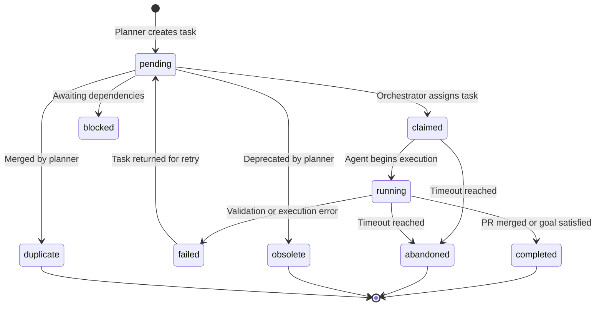
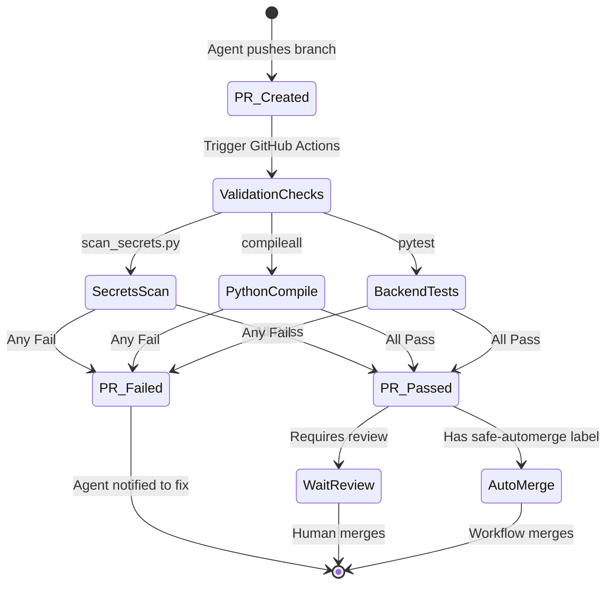
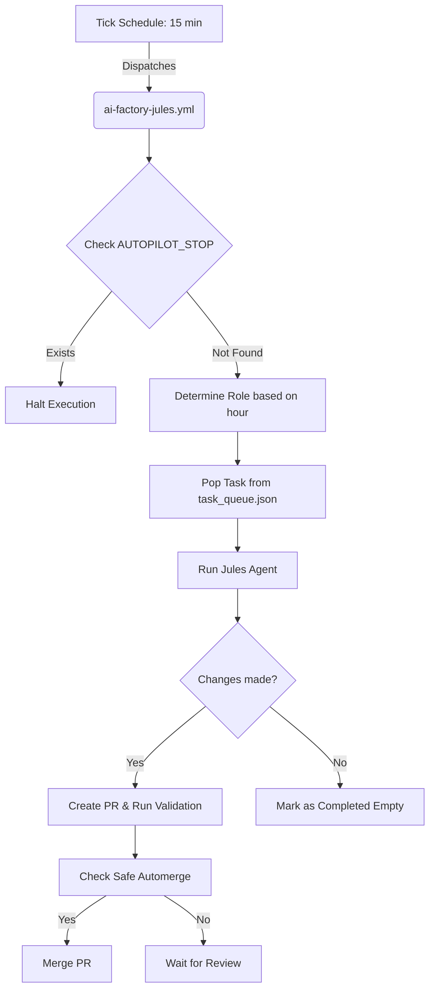

# AI Factory Operations

This repository is configured to run Jules as an autonomous GitHub development factory.

## Required GitHub Setup

1. **App Installation:** Install/connect the repository in the Jules web app.
2. **API Key Creation:** Create a Jules API key.
3. **Secret Configuration:** Add repository secrets (navigate to **Settings -> Secrets and variables -> Actions** in your repository):
   - Name: `JULES_API_KEY`
   - Value: your Jules API key
   - Name: `GH_PAT`
   - Value: A GitHub Personal Access Token (PAT) with repository permissions for the validation auto-merge step (Note: A PAT is strictly required to ensure administrative rights for merging and overriding protections).
   *(Note: `AUTOGEN_API_KEY` is not required as a GitHub Actions secret, as it is strictly a local runtime requirement.)*
4. **Action Permissions:** Ensure workflows can modify the repository. Navigate to **Settings -> Actions -> General -> Workflow permissions** and select **Read and write permissions** and check **Allow GitHub Actions to create and approve pull requests**.
5. **Action Verification:** Confirm GitHub Actions are enabled for the repository.
6. **Autopilot Activation:** The GitHub Actions workflow `AI Factory Tick` runs automatically on a schedule. By default, it will not process tasks if an `AUTOPILOT_STOP` file is present in the repository root. Ensure no `AUTOPILOT_STOP` file exists to allow the autonomous workflows to execute. To safely halt autonomous execution at any time, simply create an empty file named `AUTOPILOT_STOP` in the repository root. To resume, delete the `AUTOPILOT_STOP` file.

**Warning: Infrastructure Lock**
*Infrastructure files including `.github/workflows/`, `.github/scripts/`, and `.github/CODEOWNERS` are securely locked for AI agents. These files must only be modified via human PRs outside of the automated AI Factory framework.*

## Schedule

The workflow `.github/workflows/ai-factory-tick.yml` targets 100 Jules tasks per day by dispatching `.github/workflows/ai-factory-jules.yml`:

- 1 task every 15 minutes: 96 tasks/day
- 4 daily meta tasks: 4 tasks/day
- Maximum parallel tasks per run: 1 for normal runs, 4 for the daily meta run

This keeps the factory active around the clock with lower conflict risk while targeting the 100 task daily budget. It also reduces the impact of a delayed or skipped GitHub schedule event.

`AI Factory Jules` is intentionally `workflow_dispatch` only. This prevents duplicate Jules tasks: `AI Factory Tick` is the single scheduled heartbeat, and it dispatches normal and daily meta Jules runs through the GitHub API.

## Role Routing

Normal runs use a weighted 15-minute role sequence instead of taking the first tasks from the queue. The six-hour cycle is:

```text
Q00: planner
Q01: implementer
Q02: tester
Q03: reviewer
Q04: implementer
Q05: implementer
Q06: tester
Q07: documenter
Q08: implementer
Q09: refactorer
Q10: tester
Q11: security
Q12: architect
Q13: implementer
Q14: tester
Q15: reviewer
Q16: planner
Q17: implementer
Q18: tester
Q19: security
Q20: implementer
Q21: refactorer
Q22: documenter
Q23: tester
```

- `implementer` gets the most slots for product/backend/frontend/skills work.
- `tester` appears every hour to keep validation improving.
- `documenter`, `security`, `reviewer`, and `refactorer` rotate through smaller but regular slots.
- `architect` runs occasionally in hourly work and again in the daily meta batch.
- `planner` appears twice per six-hour cycle plus the daily meta batch, where it updates the task queue instead of touching app code.

The task planner reads `.github/ai-factory/task_queue.json`. Each task can define:

- `role`
- `lane`
- `write_scope`
- `avoid_scope`
- `risk_level`
- `automerge_allowed`
- `prompt`

Jules receives these fields directly in the prompt, so each task has a role, a purpose, and path boundaries.

## Emergency Stop

Create or keep this file in the repository root:

```text
AUTOPILOT_STOP
```

When the file exists, scheduled and normal dispatch runs produce no Jules tasks. Manual dispatch can still run with `emergency_override=true`.

## Safe Automerge

Automerge is intentionally conservative. A PR can be merged automatically only when:

- `AI Factory Validate` passed.
- The PR is not a draft.
- The PR title starts with `ai-factory(documenter):` or `ai-factory(tester):`.
- The PR has label `ai-factory:safe-automerge`.

All implementation, refactor, security, and architecture PRs require human review.

## Validation, Secrets & Local Operations

Detailed instructions for running comprehensive validation commands, evaluating vulnerability scanning, executing frontend visual validation, and safely managing local runtime secrets (including environment variables, UI updates, and configuration testing) have been consolidated into the dedicated setup guide.

**Important for AI Agents**: When you need to execute validation steps or vulnerability scanning, you must strictly follow the commands and rules listed in the guide below. For example, native Node.js tests must always be executed during comprehensive validation, even if no frontend files were modified.

👉 **[Read the Local Development Setup Guide](LOCAL_DEVELOPMENT.md)**

## Production Secrets & CI/CD

Never commit real API keys, credentials, or `.env` files to source control.

**CI/CD Environments:**
Use GitHub Actions **Repository Secrets** (navigate to **Settings -> Secrets and variables -> Actions**, then click **New repository secret**) to securely store production and testing keys. Do not use Environment Secrets or Repository Variables, as workflows expect Repository Secrets. Required secrets include:
- `JULES_API_KEY`: Your Jules API key for the AI Factory.
- `GH_PAT`: A GitHub Personal Access Token with repository permissions for validation auto-merge (Note: Required for auto-merge in validation workflows to trigger subsequent events; GITHUB_TOKEN is only used as a fallback in tick operations).

If a key was committed previously, rotate it immediately at your provider level, and close/delete the compromised branch or PR.

## Metrics Tracking

The `.github/ai-factory/metrics.json` file tracks various metrics related to the AI Factory's operation, such as `task_started`, `task_claimed`, `pr_created`, `validation_passed`, `pr_merged`, and `task_completed`. When updating these metrics, logical consistency must be maintained across interdependent fields. For example, if `pr_merged` is greater than zero, `pr_created` and `validation_passed` must logically be at least equal to that number. Note that empty PRs (where no code modifications were made due to no meaningful safe change existing) are included in the counts for `pr_merged` and `task_completed`, as they still progress through the full task and PR lifecycle.

## Workflows & Diagrams

### Task Lifecycle



### PR Lifecycle



### GitHub Actions Workflow


